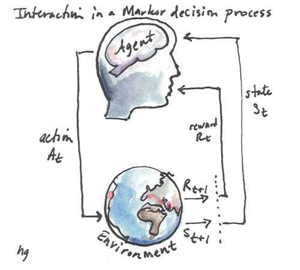

# OpenAI Scholars: Reinforcement Learning Self-Study
# Week 1: Markov Decision Processes

## Resources
1. Reinforcement Learning: An Introduction, Sutton and Barto, 2nd Edition [Jan 1 2018 Draft](http://incompleteideas.net/book/bookdraft2018jan1.pdf) *Chapter 3: Markov Decision Processes and Chapter 4: Dynamic Programming*

2. Deep RL Bootcamp Core Lecture 1 *Intro to MDPs and Exact Solution Methods* -- Pieter Abbeel  [Video](https://www.youtube.com/watch?v=qaMdN6LS9rA) | [Slides](https://drive.google.com/open?id=0BxXI_RttTZAhVXBlMUVkQ1BVVDQ)       

3. Deep RL Bootcamp Core Lecture 2 *Sample-based Approximations and Fitted Learning* -- Rocky Duan [Video](https://www.youtube.com/watch?v=qO-HUo0LsO4) | [Slides](https://drive.google.com/open?id=0BxXI_RttTZAhREJKRGhDT25OOTA)

4. Deep RL Bootcamp Lab 1: *Markov Decision Processes* You will implement value iteration, policy iteration, and tabular Q-learning and apply these algorithms to simple environments including tabular maze navigation (FrozenLake) and controlling a simple crawler robot.

5. CS294 *Reinforcement learning introduction* -- Levine [Video](https://www.youtube.com/watch?v=PTbxa6GsTWc&index=4&list=PLkFD6_40KJIznC9CDbVTjAF2oyt8_VAe3&t=0s) | [Slides](http://rail.eecs.berkeley.edu/deeprlcourse-fa17/f17docs/lecture_3_rl_intro.pdf)    

6. CS294 *Value functions introduction* -- Levine [Video](https://www.youtube.com/watch?v=k1vNh4rNYec&list=PLkFD6_40KJIznC9CDbVTjAF2oyt8_VAe3&index=7&t=0s) | [Slides](http://rail.eecs.berkeley.edu/deeprlcourse-fa17/f17docs/lecture_6_value_functions.pdf)

## Notes
RL Algorithms Diagram

Interaction in Markov decision process

Value Iteration in an MDP

